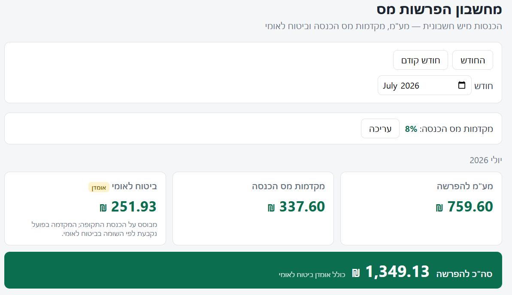

# YeshHeshbonitAPI

*[עברית](#עברית) · [English](#english)*



<div dir="rtl">

## עברית

מחשבון הפרשות מס לעוסק מורשה. הכלי מושך את החשבוניות שהוצאתם דרך ה-API של
[yeshinvoice.co.il](https://www.yeshinvoice.co.il), ומחשב עבור חודש או תקופת מע"מ
דו-חודשית כמה להפריש עבור:

- **מע"מ** — המע"מ שנגבה על החשבוניות שהוצאו
- **מקדמות מס הכנסה** — אחוז המקדמה האישי × המחזור לפני מע"מ
- **ביטוח לאומי** — הפרשה לעצמאי (אומדן)

> **כלי לא רשמי.** איננו מסונף ל-yeshinvoice ואינו מאושר על ידה. המספרים הם כלי עזר
> לתכנון ו**אינם מהווים ייעוץ מס** — המע"מ והמקדמות מדויקים, אך הביטוח הלאומי הוא אומדן
> (המקדמה בפועל נקבעת לפי השומה שלכם בביטוח לאומי). תמיד כדאי לאמת מול רואה החשבון שלכם.
> הכלי מסופק כמות שהוא (as is), ללא אחריות (ראו [LICENSE](LICENSE)).

חדשים כאן? עברו ל[מדריך ההתקנה](docs/SETUP.md).

### דרישות

- Windows עם PowerShell 7 ומעלה
- חשבון ב-yeshinvoice.co.il עם פרטי הזדהות ל-API (secret ו-userkey)
- מודול Pode (לדשבורד בלבד): `Install-Module Pode -Scope CurrentUser`

### התקנה

מדביקים את הבלוק הזה ב-PowerShell 7 (עובד מכל תיקייה — מוריד את הקוד, נכנס לתיקייה, טוען
ומגדיר):

```powershell
git clone https://github.com/Soulitek/YomHaDin.git
cd YomHaDin
Import-Module .\src\YeshHeshbonit\YeshHeshbonit.psd1
Initialize-YeshHeshbonit
```

הפקודה `Initialize-YeshHeshbonit` מבקשת את ה-secret וה-userkey שלכם (קלט מוסתר) ואת אחוז
המקדמות, מאמתת את המפתחות מול ה-API, וכותבת את `.env` ואת `config/rates.json` — שניהם
ב-gitignore, כך שהמפתחות והאחוז נשארים אצלכם במחשב.

> מריצים סקריפטים של PowerShell בפעם הראשונה? אם מופיעה שגיאת "running scripts is
> disabled", הריצו פעם אחת: `Set-ExecutionPolicy -Scope CurrentUser RemoteSigned`.

מעדיפים להגדיר ידנית? העתיקו `.env.example` ל-`.env` ואת `config/rates.example.json`
ל-`config/rates.json`, וערכו אותם. פירוט מלא ב[מדריך ההתקנה](docs/SETUP.md).

### שימוש

```powershell
# סיכום חודשי
Get-TaxSummary -Month 2026-06

# תקופת מע"מ דו-חודשית
Get-TaxSummary -From 2026-05-01 -To 2026-06-30

# ייצוא CSV לרואה החשבון
Get-TaxSummary -Month 2026-06 -ExportCsv .\2026-06-summary.csv
```

#### דשבורד

```powershell
Start-TaxDashboard              # http://127.0.0.1:8321, נפתח בדפדפן
```

דשבורד בעברית (RTL): בחירת חודש, כרטיסי הפרשה (מע"מ / מקדמות / ביטוח לאומי), סך הכל
להפרשה, טבלת חשבוניות, ועריכת אחוז המקדמות. מאזין ל-127.0.0.1 בלבד — לא נגיש מהרשת.

### רישיון

[MIT](LICENSE) © 2026 [SouliTEK](https://soulitek.co.il)

פותח ומתוחזק על ידי **[SouliTEK](https://soulitek.co.il)** — שירותי IT ואבטחת מידע.
יצירת קשר: eitan@soulitek.co.il

</div>

---

## English

Per-invoice tax set-aside calculator for an עוסק מורשה, pulling issued invoices from the
[yeshinvoice.co.il](https://www.yeshinvoice.co.il) API. For a given month or bi-monthly
VAT period, calculates how much to set aside for:

- **מע"מ** — VAT collected on issued invoices
- **מקדמות מס הכנסה** — personal advance rate × pre-VAT turnover
- **ביטוח לאומי** — self-employed contribution (estimate)

> **Unofficial tool.** Not affiliated with or endorsed by yeshinvoice. The figures are a
> planning aid, **not tax advice** — VAT and מקדמות are exact, but ביטוח לאומי is an
> estimate (your real advance is set by your Bituach Leumi assessment). Always confirm
> with your accountant. Provided "as is", no warranty (see [LICENSE](LICENSE)).

**New here? Follow the [Setup Guide](docs/SETUP.md).**

### Requirements

- Windows, PowerShell 7+
- yeshinvoice.co.il account with API credentials (secret + userkey)
- Pode module (dashboard only): `Install-Module Pode -Scope CurrentUser`

### Setup

Paste this block into PowerShell 7 (works from any folder — it clones the code, enters
the folder, imports, and configures):

```powershell
git clone https://github.com/Soulitek/YomHaDin.git
cd YomHaDin
Import-Module .\src\YeshHeshbonit\YeshHeshbonit.psd1
Initialize-YeshHeshbonit
```

`Initialize-YeshHeshbonit` prompts for your yeshinvoice API secret and userkey (masked)
and your מקדמות rate as a percent, verifies the keys against the API, and writes `.env`
and `config/rates.json` — both gitignored, so your keys and rate stay on your machine.

> First time running PowerShell scripts? If you see "running scripts is disabled", run
> once: `Set-ExecutionPolicy -Scope CurrentUser RemoteSigned`.

Prefer to configure by hand? Copy `.env.example` → `.env` and
`config/rates.example.json` → `config/rates.json` and edit them. Full details in the
[Setup Guide](docs/SETUP.md).

### Usage

```powershell
# Monthly summary
Get-TaxSummary -Month 2026-06

# Bi-monthly VAT period
Get-TaxSummary -From 2026-05-01 -To 2026-06-30

# Export a CSV for the accountant
Get-TaxSummary -Month 2026-06 -ExportCsv .\2026-06-summary.csv
```

#### Web dashboard

```powershell
Start-TaxDashboard              # http://127.0.0.1:8321, opens your browser
```

Hebrew RTL dashboard: month picker, set-aside cards (מע"מ / מקדמות / ביטוח לאומי),
total-to-set-aside, invoice table, and editable מקדמות rate. Binds to 127.0.0.1 only —
never reachable from the network.

### License

[MIT](LICENSE) © 2026 [SouliTEK](https://soulitek.co.il)

Built and maintained by **[SouliTEK](https://soulitek.co.il)** — IT services and
information security. Contact: eitan@soulitek.co.il
